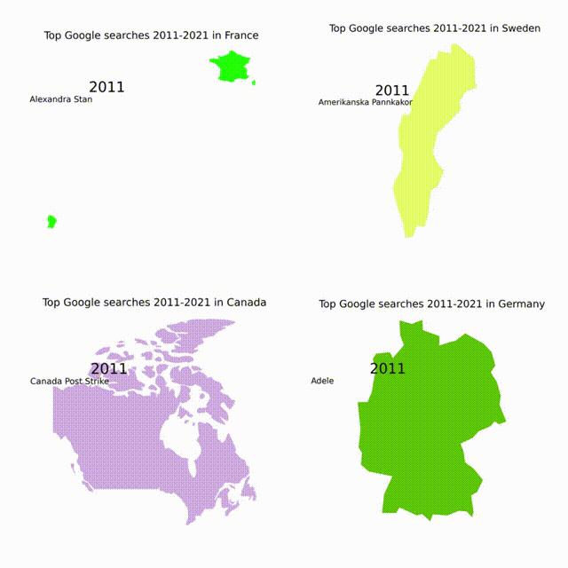

# Google-Trends
[Youtube video](https://www.youtube.com/watch?v=udi3i7miDs4)  
  

Both a notebook and a python script that can generate top searches for a specific country during chosen year interval.

#### Python script
Run python script __top_searches.py__ with command: <code>python top_searches.py '"Sweden"' SE 2011 2021</code>. This will generate top searches for sweden during 2011-2021. All the output imagase will be in .png  format. Change to .jpg before creating a gift with the command <code>mogrify -format jpg *.png</code>. Make sure you have ImageMagick: <code>convert -version</code>.
#### Python Notebook
Open notebook __python_searches.ipynb__ and run the cell. Change inparameters for main method call if you want another country, or year interval.  
Examples:  
<code>main('"France"', 'FR', 2011, 2021)</code>  
<code>main('"Sweden"', 'SE', 2015, 2021)</code>  
<code>main('"Germany"', 'DE', 2020, 2021)</code>

#### Create gif  
Open terminal and go to the country directory you have generated and run:  
<code>convert -resize 20% -delay 80 -loop 0 *.jpg topsearch.gif</code>  
Make sure you make following changes in the file __policy.xml__ in __/etc/ImageMagick-6__ folder if you get any errors:
```text
<policy domain="resource" name="memory" value="256MiB"/> --> <policy domain="resource" name="memory" value="4GiB"/>   
<policy domain="resource" name="map" value="256MiB"/> --> <policy domain="resource" name="map" value="4GiB"/>   
<policy domain="resource" name="disk" value="1GiB"/>  --> <policy domain="resource" name="disk" value="8GiB"/>  
```
